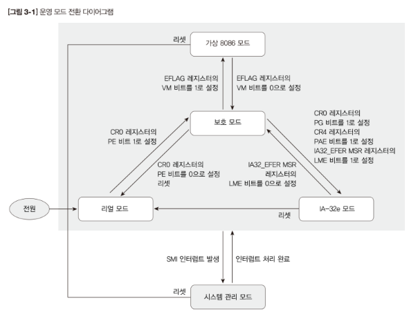
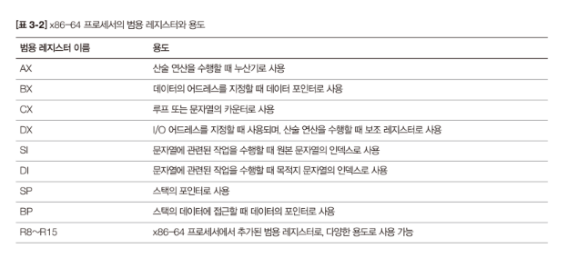
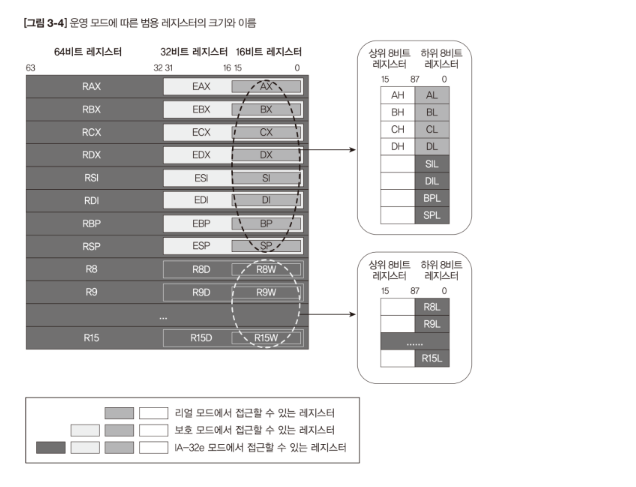
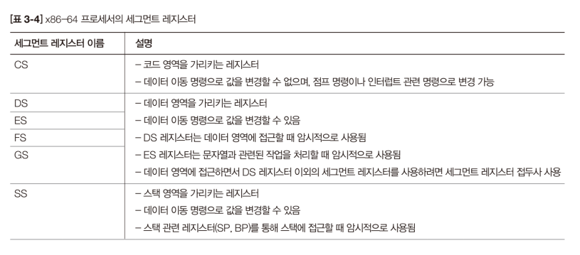
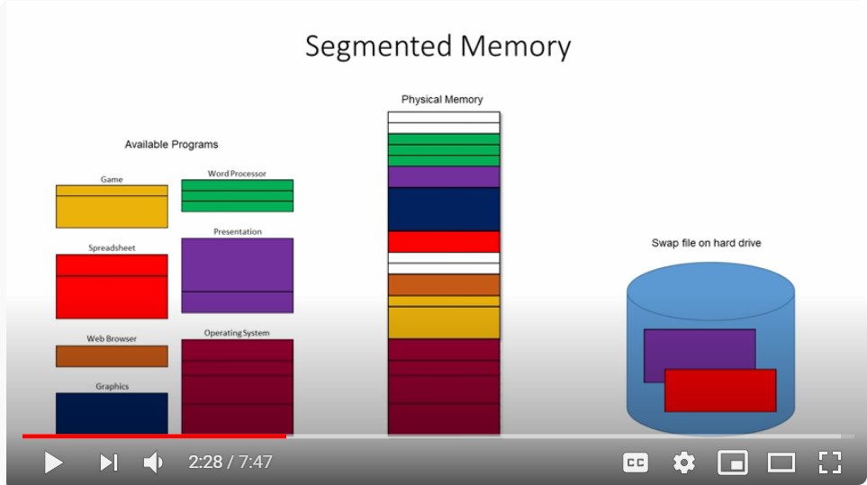
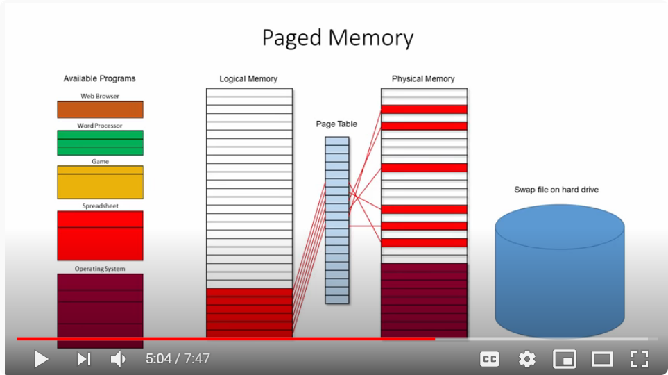
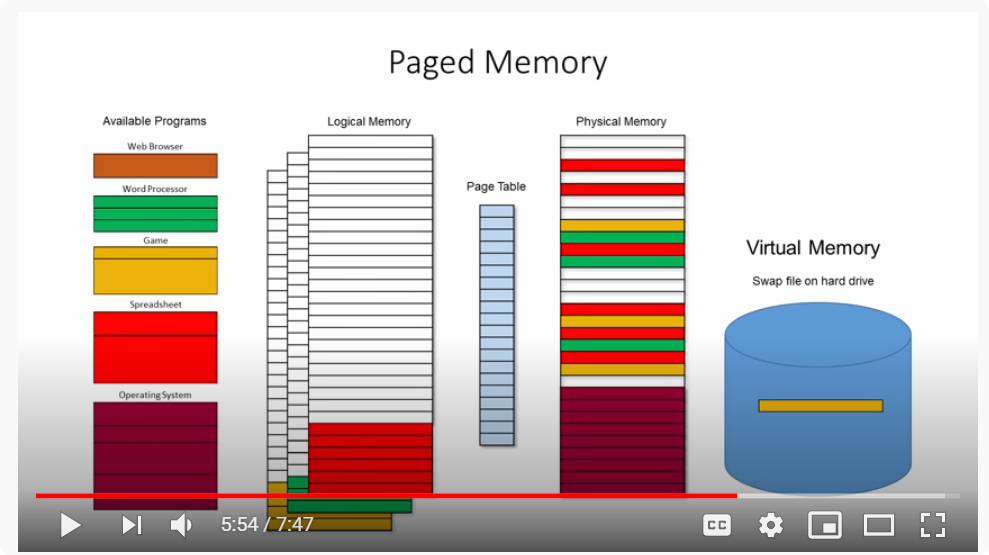
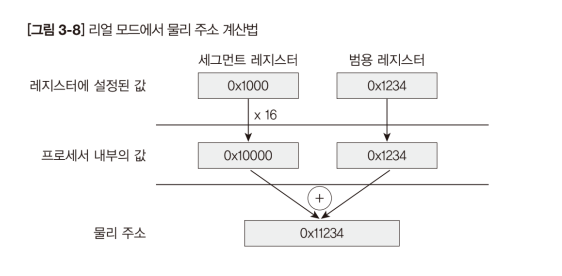
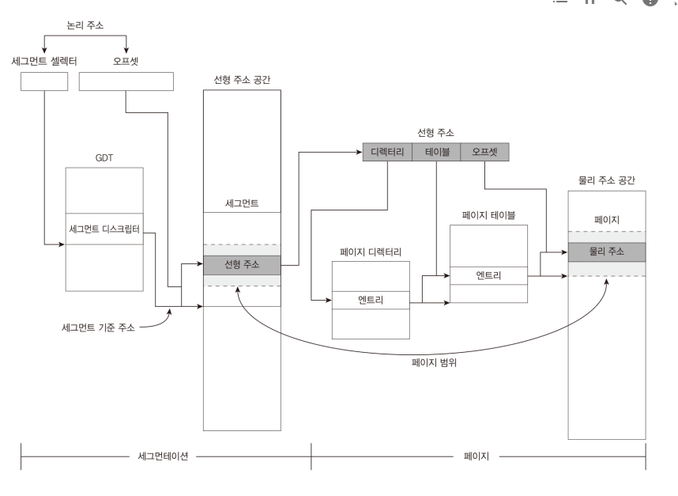
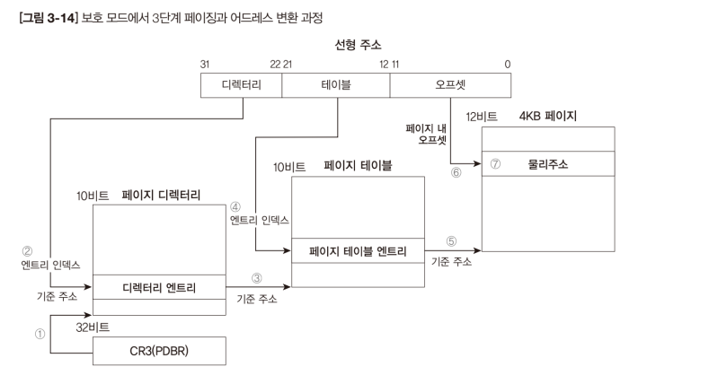

## 3.1 운영모드
인텔 모드 기준으로 공부
- 리얼 모드, 보호 모드, IA-32e 모드, 시스템 관리 모드, 가상 8060 모드

이 중에서 우리가 기억해야 하는 세 가지 모드는 리얼 모드, 보호 보드, IA-32e 모드이다.
이 외 모드들은 특수한 기능 수행

💻
1. 리얼 모드: 전원이 켜지거나 리셋되면 프로세서는 무조건 리얼모드 진입. *디스크 읽기 및 쓰기, 그래픽 모드로 전환하는 기능*[BIOS 기능이라고 부름]을 가능케 한다.
BIOS 기능 덕분에 디바이스 드라이버를 제작하지 않고도 원하는 작업가능하다는 장점이 있지만 대부분 작업을 어셈블리어로 처리해야 하므로 개발하기 어렵다는 단점이 있다. 
OS 이미지를 디스크에서 메모리로 복사하는 작업을 하는 모드이다!

2. 보호 모드: 리얼 모드에서 IA-32e 모드로 전환할 때 반드시 거쳐야 하는 모드. 32비트 윈도우와 리눅스os가 동작하는 기본 모드.
OS의 필수 기능으로 자리 잡은 보호, 멀티 태스킹, 세그멘테이션, 페이징 등의 기능을 하드웨어적(?) 으로 지원.
여러 기능을 제공 -> 복잡하고 **레지스터**와 **자료구조**가 다양.
여기에서 사용되는 대부분 레지스터는 IA-32e모드에서 사용될 수 있다.

3. IA-32e 모드: 서브모드로 32bit호환모드, 64bit호환모드가 있다. 32bit호환모드는 보호모드와 같은 기능 수행.
64bit모드는 레지스터가 보호모드보다 많다. 하지만 자료 구조는 보호모드와 같거나 크기만 2배로 확장, 일부 필드의 의미 변하는 정도.

## 3.2 운영모드와 레지스터
레지스터: 프로세서 안에 있는 작은 공간으로 연산, 제어, 상태표시, 디버깅 목적으로 사용됨.

가장 중요한 레지스터 3개
1. 범용 레지스터: 운영모드와 가장 관계 깊은 레지스터. 계산, 메모리address 지정, 임시저장공간 등의 목적으로 사용.
운영모드 앞에 붙는 숫자와 범용레지스터의 크기는 대체로 일치 하지만 달라도 놀라지 말 것.
범용레지스터가 많으면 수행 속도 개선 bc 메모리에 접근하는 시간을 줄여줌.
고정된 기능이 없다(R8~R15) 하지만 특별한 레지스터는 특수한 용도로만 사용이 약속됨.
AX --- DX, SP --- BP

64비트 범용 레지스터는 하위 32비트, 16비트, 8비트의 크기로 구분해 접근할 수 있고, 레지스터의 접듀사나 접미사로 그 크기를 나타냄. 다음 그림에서 접미사 접두사의 특징을 찾아보자.

2. 세그먼트 레지스터: 16bit레지스터로 어드레스 영역을 다양한 크기로 구분. 부가적으로 보호모드나 IA-32e모드에서는 접근권한, 세그먼트의 시작 어드레스와 크기 지정하는 데 사용 ➡ 커널 보호.

CodeSegment/ DataSegment, ExtraSegment, FS, GS (two letters that followed)  /StackSegment
세그멘테이션은 세그먼트 레지스터를 이용해 주소 구분하는 방식

3. 컨트롤 레지스터: 운영 모드 변경, 현재 운영 중인 모드의 특징 기능을 제어. *프로세스의 운영모드와 확장기능*을 관장 => 복잡. 
비트0은 보호모드와 리얼모드를 전환하는 플래그이며 자료구조 등을 플래그를 바꾸기 이전에 처리해줘야 한다.

## 3.3 메모리 관리 기법
- 세그멘테이션: 큰 메모리를 분할해서 사용

- 페이징: 작은 메모리를 모아서 사용

1. 리얼모드: 최대 1MB 주소공간 사용 + 세그멘테이션만 지원. 페이징을 사용하지 않아 물리주소로 변환 쉬움. 세그먼트레지스터 값에 범용레지스터 값을 더하는 방식으로 동작.
세그먼트레지스터의 값에 16곱하고 범용레지스터를 더한 값이 실제 물리주소가 된다. (1MB까지 접근 가능)

2. 보호모드: 세크멘테이션(리얼모드보다 advanced)과 페이징 지원. 보호모드의 세그멘테이션은 세그먼트레지스터에 세그먼트 기준 주소를 직접 설정하는 대신 디스크립터 자료구조의 위치를 설정하는 방식으로 바뀜.
따라서 **명칭도 세그먼트 레지스터에서 디스크립터의 자료구조의 위치(offset)을 설정한다는 의미에서 세그먼트 셀렉터로 변경됨!** 
디스크립터는 메모리 영역의 정보를 저장하는 자료구조. 세그먼트에 대한 정보를 나타내는 디스크립터를 *세그먼트 디스크립터*라고 함.
세그먼트 디스크립터에는 세그먼트의 시작 어드레스 크기, 권한(낮을 수록 높은 권한), 타입에 대한 정보가 있음.
세그먼트 디스크립터는 GDT(Global Descriptor Table)이라고 불리는 곳에 모여 있음. GDT는 연속된 디스크립터의 집합.
주소를 계산하면 선형주소가 나오고 선형주소를 기반으로 물리주소 계산.

**페이징**은 물리메모리를 페이지라고 불리는 일정한 크기로 나누고, 선형주소와 물리주소를 나눠 놓은 페이지로 연결하는 방식을 말함. 주소공간을 더 넓게 사용할 수 있는 장점이 있다.
응용프로그램끼리 공유하는 메모리를 쉽게 처리 가능. 페이징 방식 중에 *3단계페이징*은 *디렉터리, 테이블*(각기 페이지 엔트리 위치), 오프셋 세 부분으로 나누고 물리메모리를 4kb패이지로 나누어 관리하는 방식임. 

 ** 주소 이해하는 거 힘듦 [ ] 다시보기
 
 3. IA-32e 모드의 메모리 관리
 2^64가 최대 어드레스! (1)모든 세그먼트가 기준주소 0, 크기 64bit 전체로 설정됨. 디스크립터를 확장하지 않고 강제고 값을 고정해서 이렇게 해결함.
 선형주소를 기준주소가 다른 여러개의 세그먼트로 구분하지 못하는 것을 고려할 것! *세그먼트기주준주소로구분못한다~*
 (2)서브모드 구분을 위해 세그먼트 디스크립터에 L필드를 추가
 페이징기능이 5,4단계로 커짐! (page-directory-pointer-table.. etc)
 
 
 
 