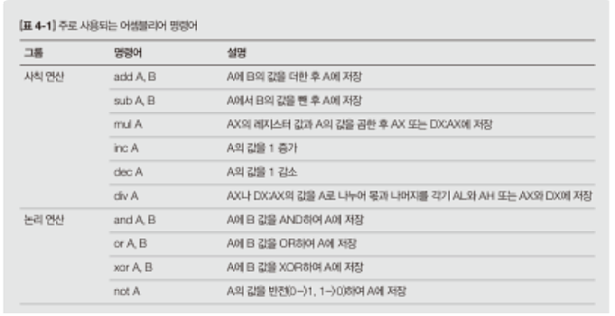
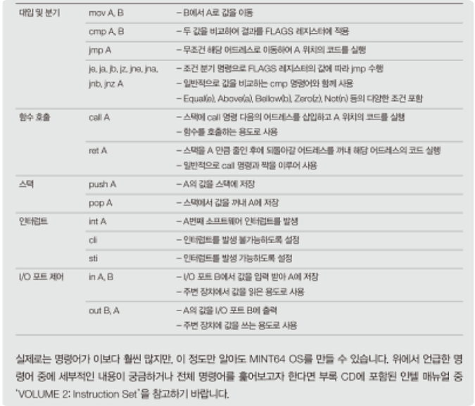
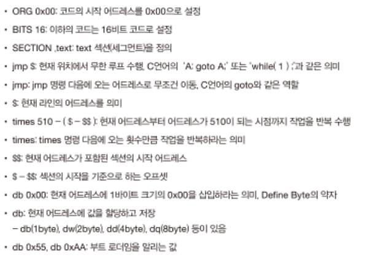
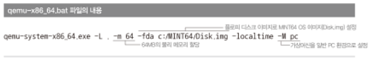
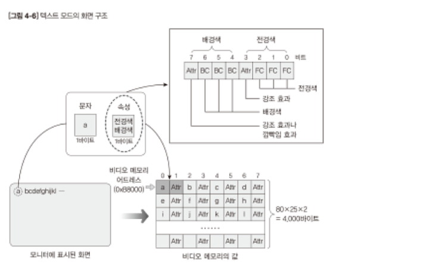
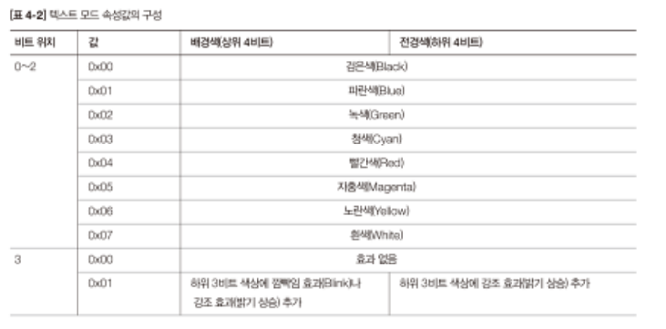
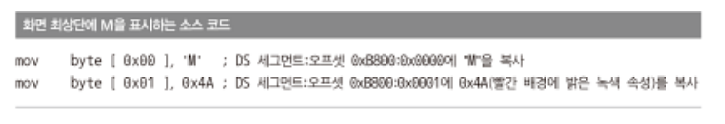

# 내 PC 를 부팅하자
### 4.1 부팅과 부트 로더
부팅은 PC이 켜진 후 OS가 실행되기 전까지 수행되는 일련의 작업과정을 의미: 프로세서 초기화, 메모리와 외부디바이스 검사 및 초기화, 부트로더를 메모리에 복사하고 OS를 시작하는 과정 등이 포함됨.
- BIOS: 메인보트에 포함된 펌웨어의 일종. 입출력 담당. 전원이 켜진 동시에 가장 먼저 실행하는 코드임!
MINT64는 OS 이미지를 메모리에 복사하고 GUI 모드로 변환할 때 BIOS기능을 사용함.
    - 부팅과정에서 수많은 작업을 하지만, 그중에서 **부트로더 이미지를 복사** 하는 것이 우리에게 가장 중요!
        - 부트로터: BIOS에서 처음으로 제어를 넘겨받는 부분! BIOS는 POST(Power On Self Test)가 완료된 후 여러 장치를 검사하여 앞부분에 부트 로더가 있는지 확인함. 부트로더가 존재한다면 코드를 0x7C00어드레스에 복사한 후 프로세서가 0x7C00 어드레스부터 코드를 수행하도록 함.
        - 부트로더가 디스크에서 메모리로 복사되어 실행됨 == BIOS에 의해 PC가 정상적으로 구동됨. == 우리가 만든 OS를 메모리에 올려 실행할 준비가 됨.
        - 부트로더는 외부 저장 매체이 존재
        - 부트로더의 크기는 512KB로 제한되므로 할 수 있는 기능이 많지 않다
        - BIOS는 첫섹터가 부트로더임을 확인하려고 마지막 바이트가 0X55 & 0xAA임을 확인
        
### 4.2
intellij로 makefile 빌드하는 방법은 addon으로 makefile support 플러그인을 설치하고, makefile을 run하는 방법이다
       
### 4.3 부트로더 제작과 테스트
- requirement: 부트섹터 *512바이트* 마지막에 0x55, 0xAA를 넣어주면 됨  

Assembly언어로 작성해야 한다. 우리는 인텔문법을 따른다.

        

#### Qemu 설정

#### 화면 버퍼와 화면 설정

어드레스 안의 메모리에 접근하려면 \[\]를 사용해야 함
    e.g\[0x00\]

