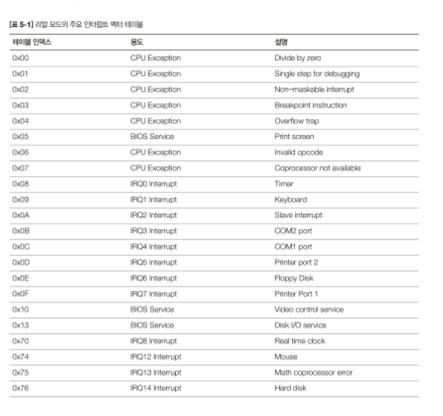

# 플로피디스크에서 OS이미지를 로딩하자
빌드가 끝나면 MINT64는 플로피디스크용으로 생성됨. 이는 부트로더가 플로피디스크에서 OS이미지를 읽어 메모리로 복사해야 한다는 것을 의미함.
플로피디스크를 제어하는 방법은 플로피컨트롤러에 직접 접근 / BIOS서비스 이용하는 방법 등이 있다. 여기서는 BIOS기능을 사용해서 처리함. (더 간편)

- 지금은 로딩할 OS가 없어서 OS부터 만들고 시작하자!

### 5.1서비스와 소프트웨어 인터럽트
BIOS는 자신의 기능을 특별한 방법으로 외부에 제공.
- 함수어드레스를 IVT(Interrupt Vector Table)에 넣어두고 SWI(Software Software Interrupt)
- IVT는 메모리어드레스 0에 있는 테이블로 특정 번호의 인터럽트가 발생했을 때 인터럽트를 처리하는 함수(Interrupt Handler)검색에 사용됨

- BIOS 가 지원하는 디스크 서비스를 사용하려면 0x13인터럽트를 발생시켜야 함.

BIOS 서비스는 SWI를 통해 호출할 수 있지만 BIOS도 만능은 아니라 작업에 관련된 파라미터를 넘겨줘야 함.\
How? 레지스터!!

섹터크기의 이미지를 메모리로 복사하는 소스코드(c언어)
```c
int main(int arc, char* argv[]) {
    int iTotalSectorCount = 1024;
    int iSectorNumber = 2;
    int iHeadNumber = 0;
    
    //실제 이미지를 복사할 물리주소
    char* pcTargetAddress = (char*) 0x10000;
    
    while(1){
        if(iTotalSectorCount == 0) { break;}
        iTotalSectorCount = iTotalSectorCount -1;
        
        // 1 섹터를 읽어들려서 메모리 어드레스에 복사
        if (BIOSReadOneSector(iSectorNumber, iHeadNumber, iTrackNumber, pcTargetAddress) == ERROR) { HandleDiskError();}
        // 1섹터는 512(0x200)바이트로, 복사한 섹터 수만큼 어드레스 증가
        pcTargetAddress = pcTargetAddress + 0x200;
        //섹터 -> 헤드 -> 트랙 순으로 번호 증가
        iSectorNumber = iSectorNumber+1;
        if (iSectorNumber < 19) { continue; }
        
        iHeadNumber = iHeadNumber ^ 0x01;
        iSectorNumber = 1;
        
        if (iHeadNumber != 0) { continue; }
        iTrackNumber = iTrackNumber +1;      
    }
    return 0;
}
```